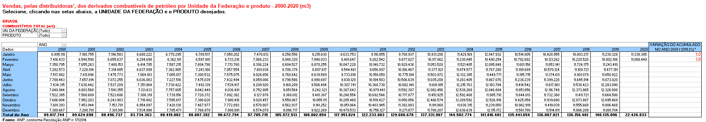
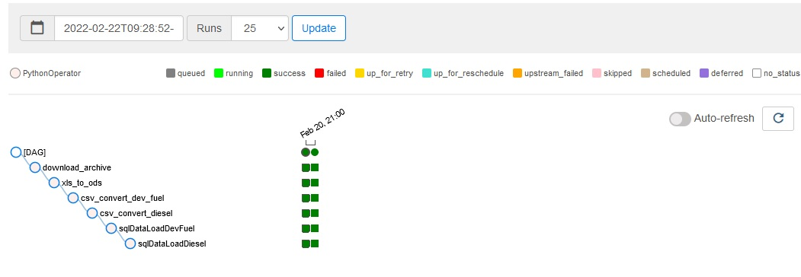
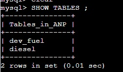
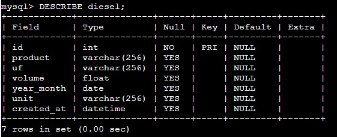

# ANP Fuel Sales ETL Test

## Objective

This test consists in developing an ETL pipeline to extract internal pivot caches from consolidated reports made available by Brazilian government's regulatory agency for oil/fuels, ANP (Agência Nacional do Petróleo, Gás Natural e Biocombustíveis).
### Goal

This `xls` file has some pivot tables like this one:

The developed pipeline is meant to extract and structure the underlying data of two of these tables:
- Sales of oil derivative fuels by UF and product
- Sales of diesel by UF and type

The totals of the extracted data must be equal to the totals of the pivot tables.

### Schema

Data should be stored in the following format:

| Column       | Type        |
| ------------ | ----------- |
| `year_month` | `date`      |
| `uf`         | `string`    |
| `product`    | `string`    |
| `unit`       | `string`    |
| `volume`     | `double`    |
| `created_at` | `timestamp` |

# Solution
The solution developed on docker and using the Airflow pipeline orchestrator: 

Usando mysql para armazenamento dos dados :

Using mysql for data storage :

Table structure :

Row quantity:

`dev_fuel` = 54.432

`diesel` = 12.960

The data storage is also located on [Data_Enginner_test/data](https://github.com/radsonpatrick/Data_Enginner_test/tree/main/data) the output format on `csv` from Sales of oil derivative fuels [dev_fuel.csv](https://github.com/radsonpatrick/Data_Enginner_test/blob/main/data/dev_fuel.csv) and Sales of diesel [diesel.csv](https://github.com/radsonpatrick/Data_Enginner_test/blob/main/data/diesel.csv) 

# How to run

## Requirements
* [Docker](https://docs.docker.com/engine/install/ubuntu/)
* [Docker-compose](https://docs.docker.com/compose/install/)

`git clone https://github.com/radsonpatrick/Data_Enginner_test.git`

`cd Data_Enginner_test`

`docker-compose up airflow-init`

`docker-compose up`

After installation acess on browser `http://localhost:8080`
